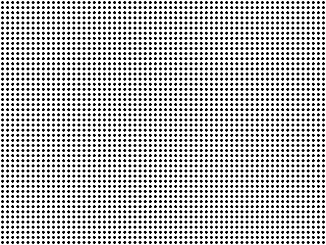

# Shapes from Pixels
In this exercise the goal is to create shapes based on the underlying pixels. The final result should look like something in the _shapesFromPixels.mkv_ video.

## Step by step
Start and empty project and make the following changes:

1. Inside the _ofApp.h_ file create the following variables:
* `vidGrabber` of type ofVideoGrabber to grab the video images from the webcam
* `pixels` of type `ofPixels` to store the pixels from each frame so that we can read them
* `spacing` of type `int` to help us make a grid
* `startPos` of type `int` to help us make a grid too.
2. In _main.cpp_ set the size of the window to 640x480.
3. In the `setup()` function, set the background to white and make the appropriate calls to `vidGrabber` we saw in the previous exercises. Make sure the `vidGrabber` is initialized to the size of the window. We want high resolution frames now. Set the `spacing` to 10, the `startPos` to `spacing/2` (do you know why?).
4. Inside the `update()` call the `update()` on the `vidGrabber` as we saw in previous assignments. Also, call the `getPixels()` command on the `vidGrabber` (see [documentation](http://openframeworks.cc/documentation/video/ofVideoGrabber.html#!show_getPixels)) and store the returning value inside the `pixels` variable. Ready for drawing our shapes!
5. Let's start by making sure we can create a grid again. Use a nested for-loop (a loop within a loop) to fill all of the screen with circles every `spacing` pixels. You'll need to use the `spacing` variable somewher in your for loops declaration. The create two local variables of type `int` called `locX` and `locY` to calculate the position of each shape. Make sure you take `startPos` into account. Then use the `ofPushMatrix()`/`ofTranslate()`/`ofPopMatrix()` combination to draw circles of size 10 and color black. You should see this familiar sight on the screen:
<br>
<br>

<br>
<br>
Let's now try to give the circles a bit of life.
6. Inside the for-loop get the color (see [getColor](http://openframeworks.cc/documentation/graphics/ofPixels.html#!show_getColor)) of the pixel at the location specified by the indices used in the for loops (the same ones we use to draw the circles in the previous step). Store the returning value in a variable of type `ofColor` called `c`. Get the brightness of `c` using the `getBrightness()` command, store it in a variable of type `int` called `brightness`. Set the color of the shapes to `c`. Create a local variable of type `float` called `radius` and use the `ofMap()` function on the brightness to map it from (0,255) to (maxSize,0), where `maxSize` is a local variable set to 10. Notice the order! The brigther the pixel is the smaller the circle, revealing from behind the white background. Use the `radius` inside the `ofCircle` command to adjust the size of the circle. You should now have the finished article!
7. Bonus: How about having a dynamic `maxSize`. Depending of where the mouseX is on the screen `maxSize` ranges from 0 to `spacing*2`.

## Mode2
1. Now that you created the circles let's try something else. Create a variable of type `int` in the `ofApp.h` and set it to 1 in the `setup()` function. Our program will have 2 modes. The circle mode and the line mode.
2. Inside the `keyPressed()` function check if the 1 or 2 button was pressed and set the `mode` variable accordingly. So far this should not change the behavior of your program, but it should compile without problems.
3. Put all of the code inside the nested for-loop inside an if-statement, like this:
```
if (mode==1) {
   // draw the circles
}
```
If `mode` is equal to 2, then we'll draw lines. Copy all the code you have written for circles inside the `mode==2` case and modify it so that:
* You set the line width using `ofSetLineWidth()` with `ofMap()` and brightness with resulting values ranging from (3,1). The darker the pixel the thicker the line.
* Use again `ofMap()` to dynamically calculate the `maxSize`, only this time it should be mapped to `(0,spacing*4)`.
* Instead of `radius` now we have a `float` called `length`. Using `ofMap()` map it to `(maxSize,3)`. That means that the brigther it is, the shorter the line.
* Replace the `ofCircle()` command with the `ofLine()`, using the `length` for line length, of course.
* Finally for the killer feature: Use `ofRotate()` with `ofMap()` to map the brightness to the domain `(0,180)`. This means that the lines rotate depending on the brightness of the underlying image, giving this "hairy" effect. You should now be be able to switch between the two modes as well as affect aspects of their by moving the mouse on the X-axis.

----
# Assignment for home
* Any other shapes or transformations you could use?
* You could play also with the size of the dots on the grid.
